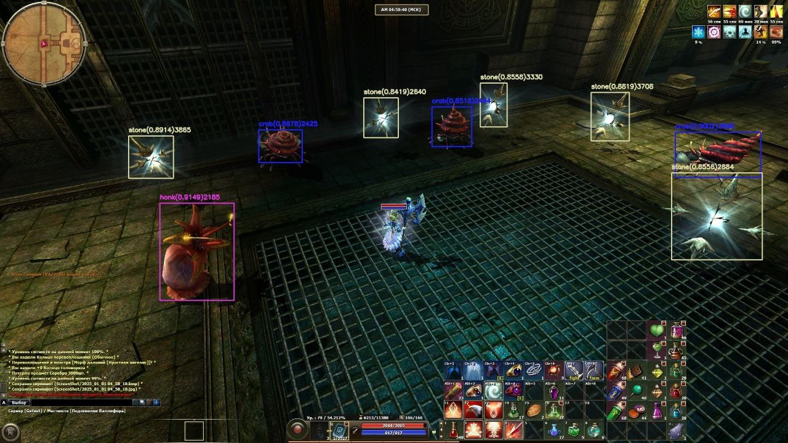

# R2 Online YOLOv11-based bot

## Description

The model is trained on the monsters of the Valefor dungeon.

Recognizes monsters, attacks them by controlling the cursor.
Part of the functionality like using abilities and potions, getting the amount of HP is done by determining the position and color of a pixels, 
which varies depending on the game client and screen resolution.

## Installation

Python 3.10.11 is required.
```
pip install -r r2_detection/requirements.txt
```

## Usage

Run the game and choose a character.

Run the main script with:

`python r2_detection/main_farm.py`

After running, click on the skull icon that appears.


